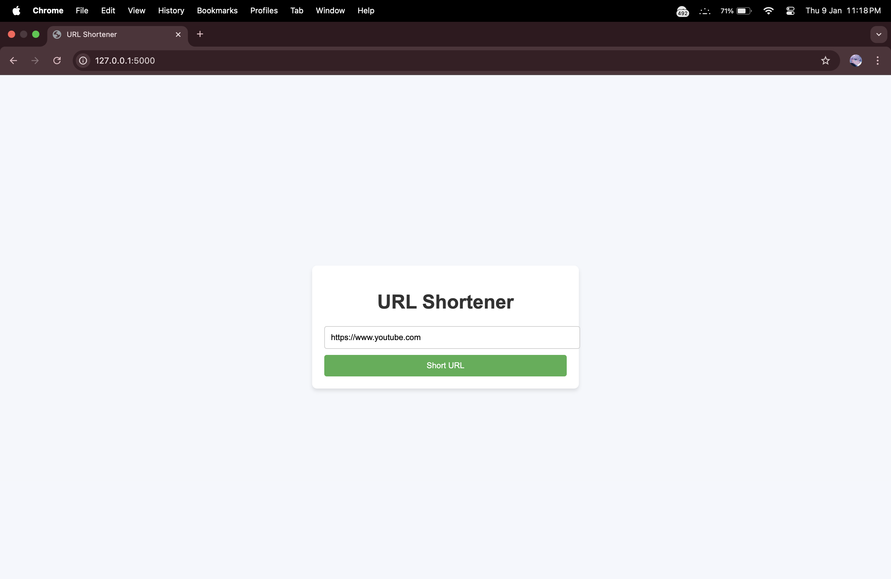

# URL Shortener

A simple Flask application that allows users to shorten long URLs and retrieve them using unique shortened paths. This project demonstrates the use of Flask for web development and basic JSON file handling for data storage.

---

## Features

- Shortens long URLs to a unique, randomly generated 6-character path.
- Stores shortened URLs in a JSON file for persistence.
- Redirects users to the original long URL when the shortened URL is accessed.
- Modern and user-friendly interface for URL input and result display.
- Handles duplicate long URLs by providing the same shortened link.

---

## Installation

1. Clone the repository:  
   ```bash
   git clone https://github.com/Rahil71/URL-Shortener.git
   cd URL-Shortener
   ```

2. Install the required Python packages:  
   ```bash
   pip install flask
   ```

3. Run the application:  
   ```bash
   python app.py
   ```

4. Open your browser and navigate to:  
   [http://127.0.0.1:5000](http://127.0.0.1:5000)

---

## Usage

1. Enter a long URL in the input field and click **"Short URL"**.
2. A shortened URL will be generated and displayed on the screen.
3. Use the shortened URL to redirect to the original URL.

---

## Project Structure

```plaintext
URL-Shortener/
├── app.py             # Main Flask application
├── urls.json          # JSON file to store shortened URLs
├── templates/
│   ├── index.html     # Homepage template
│   ├── result.html    # Shortened URL display template
├── static/            # Static files (if any)
└── README.md          # Project documentation
```

---

## Screenshots

_Add screenshots of the project here._

1. **Homepage**  
   

2. **Shortened URL Result**  
   

---

## Contributing

Contributions are welcome! Feel free to fork the repository, make changes, and submit a pull request.  

---

## License

This project is licensed under the MIT License. See the [LICENSE](LICENSE) file for details.

---

## Author

[Rahil71](https://github.com/Rahil71)